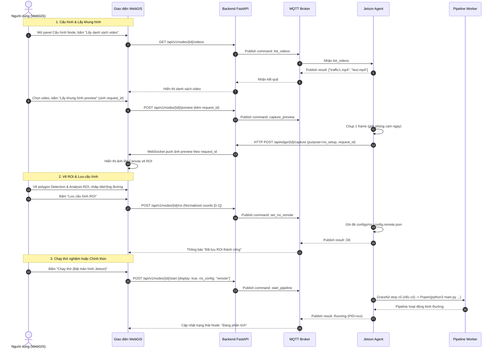

# Chốt Phương Án — Điều Khiển Jetson Từ Xa Qua WebGIS (Bản Cập Nhật Chuẩn Hóa)

> Tài liệu này chốt toàn bộ kiến trúc và thiết kế kỹ thuật cho chức năng: WebGIS gửi lệnh → Jetson thực thi tác vụ phân tích giao thông theo yêu cầu, có thể kiểm chứng bằng màn hình vật lý trong giai đoạn thử nghiệm, tắt màn khi chạy chính thức. Đã tích hợp các giải pháp chống rò rỉ VRAM, xung đột camera CSI và đồng bộ với hạ tầng backend hiện có.

---

## 1. Nguyên tắc thiết kế cốt lõi

1. **Jetson chỉ nhận lệnh và báo cáo — không bao giờ mở cổng chờ kết nối đến (inbound)**:
   - Mọi kết nối đều do Jetson **chủ động khởi tạo** ra ngoài (MQTT TLS connect, HTTP POST) — tuyệt đối không chạy HTTP/REST server trên Jetson. Thiết kế chuẩn cho thiết bị biên sau NAT/Firewall/4G, không cần cấu hình port-forwarding hay IP tĩnh.
2. **Kiến trúc 2 tầng: Agent giám sát (Daemon) & Pipeline xử lý (Worker)**:
   - **Jetson Agent**: Tiến trình nền nhẹ chạy vĩnh viễn (`--restart always`), kết nối MQTT, nhận lệnh, quản lý vòng đời worker.
   - **Pipeline Worker**: Tiến trình con chạy DeepStream/TensorRT do Agent kích hoạt qua `subprocess.Popen`.
3. **1 script phân tích dùng chung cho mọi nguồn gọi**:
   - Chạy bằng tay (CLI) hay do Agent gọi đều dùng chung 1 script core — khác nhau chỉ ở **tham số dòng lệnh** truyền vào (`--roi-config`, `--display`/`--no-display`, `--source`). Không tồn tại 2 phiên bản logic song song.
4. **Danh sách lệnh là whitelist cứng (Zero-RCE)**:
   - Jetson từ chối ngay lập tức bất kỳ lệnh nào không nằm trong danh sách định nghĩa sẵn. Tham số video là tên file nằm trong thư mục cố định được kiểm duyệt (không nhận đường dẫn file tùy ý).
5. **Dọn dẹp tài nguyên an toàn (Graceful Shutdown)**:
   - Khi dừng pipeline, gửi `SIGINT` để GStreamer dọn dẹp pad và giải phóng bộ nhớ GPU/VRAM TensorRT trước khi thoát, chống tràn VRAM trên Jetson Nano (4GB).

---

## 2. Thành phần & công nghệ áp dụng

| Thành phần | Công nghệ | Vai trò & Đặc tả |
|---|---|---|
| **Jetson Agent** | Python 3.6, `paho-mqtt` 1.6.1, `subprocess` | Tiến trình nền chạy suốt vòng đời container, kết nối MQTT, nhận lệnh, điều phối pipeline worker |
| **Kênh lệnh + trạng thái** | MQTT TLS (Port 8883), QoS 1 cho lệnh/kết quả, QoS 0 cho telemetry | Đồng bộ theo namespace topic hiện có của backend (`traffic/<edge_id>/...`) |
| **Kênh truyền ảnh** | HTTP POST multipart (Jetson → Backend), kèm header `X-Edge-Token` | Tái sử dụng cơ chế snapshot `uploader.py`, mở rộng thêm tham số `purpose`, `request_id` |
| **Pipeline phân tích** | GStreamer + DeepStream 6.0.1 (`nvarguscamerasrc`/`uridecodebin` → `nvinfer` → `nvtracker` → `analytics/` → `nvdsosd` → `nveglglessink`/`fakesink`) | Nhận tham số `--roi-config` và cờ `--no-display` |
| **Backend trung gian** | FastAPI + WebSocket (Port 8000) | Dịch lệnh WebGIS thành MQTT command, cache ảnh `roi_setup` trong RAM, forward realtime qua WebSocket |
| **WebGIS Frontend** | React, HTML5 Canvas, WebSocket | Giao diện điều khiển trực quan: chọn video, hiển thị frame preview, vẽ polygon ROI, gửi tọa độ chuẩn hóa |

---

## 3. Hợp đồng giao tiếp (Communication Contract)

### 3.1. Thống nhất Topic MQTT (Đồng bộ với Backend hiện hữu)

Để khớp 100% với hạ tầng `webgis/backend/services/mqtt_service.py` hiện tại, hệ thống sử dụng tiền tố chuẩn `traffic/`:

| Topic | Chiều | QoS | Nội dung / Payload |
|---|---|---|---|
| `traffic/<edge_id>/heartbeat` | Jetson → Backend | 1, LWT (Last-Will) | `{"edge_id": "...", "status": "online"/"offline", "timestamp": "..."}` |
| `traffic/<edge_id>/telemetry` | Jetson → Backend | 0 | Lưu lượng, điểm ùn tắc, tốc độ TB (`congestion_score`, `avg_speed_kmh`, `vehicle_count`...) |
| `traffic/<edge_id>/device-health` | Jetson → Backend | 1 | Chỉ số phần cứng: FPS, % CPU, % GPU, % RAM, Nhiệt độ (°C), IP, Uptime |
| `traffic/<edge_id>/command` | Backend → Jetson | 1 | `{"action": "...", "command_id": "...", "params": {...}}` (hỗ trợ alias `cmd` & `request_id`) |
| `traffic/<edge_id>/command-result` | Jetson → Backend | 1 | `{"command_id": "...", "action": "...", "status": "completed"/"error"/"rejected", "message": ...}` |

> *Ghi chú:* Agent hỗ trợ parse linh hoạt cả cặp key `("action", "command_id")` lẫn `("cmd", "request_id")` để đảm bảo tương thích ngược.

### 3.2. Danh sách lệnh Whitelist (`communication/command_router.py`)

| Lệnh (`action`) | Tham số (`params`) | Hành vi của Agent | Phản hồi (`command-result`) |
|---|---|---|---|
| `list_videos` | — | Quét thư mục cố định `/app/Video` (chỉ trả về file `.mp4`, `.mkv`, `.h264`) | `{"status": "completed", "message": ["cam1.mp4", "test.mp4"]}` |
| `capture_preview` | `source_type`, `source`, `request_id` | **Xử lý xung đột:** Nếu pipeline đang chạy, trích xuất frame từ stream hiện tại. Nếu đang rảnh, gọi `grab_one_frame()` rồi giải phóng camera ngay (`cap.release()`). Upload ảnh qua HTTP với `purpose="roi_setup"`. | `{"status": "completed", "message": "Preview frame uploaded successfully"}` |
| `set_roi_remote` | `detection_roi`, `analysis_roi`, `road_width_m`, `road_length_m` | Kiểm tra tính hợp lệ của tọa độ [0.0 - 1.0], ghi đè file `configs/roi_config.remote.json` | `{"status": "completed", "message": "Remote ROI saved successfully"}` |
| `start_pipeline` | `source_type`, `source`, `roi_config` (`"local"`\|`"remote"`), `display` (bool) | Nếu có pipeline cũ đang chạy → gọi quy trình **Graceful Stop** trước. Sau đó kích hoạt tiến trình mới: `subprocess.Popen(["python3", "main.py", ...])`. | `{"status": "completed", "message": {"pid": 1234, "state": "running"}}` |
| `stop_pipeline` | — | Thực hiện quy trình dừng Graceful Stop tiến trình pipeline hiện tại | `{"status": "completed", "message": "Pipeline stopped successfully"}` |
| `capture_snapshot`| `reason` | Kích hoạt chụp ảnh thủ công từ luồng OSD và upload với `purpose="manual"` | `{"status": "completed", "message": "Snapshot enqueued"}` |
| `get_health` | — | Thu thập metrics CPU, RAM, GPU, nhiệt độ và publish vào topic `device-health` | `{"status": "completed", "message": {...}}` |

*Bất kỳ action nào không thuộc danh sách trên → trả về `status: "rejected"` và ghi log cảnh báo.*

### 3.3. Endpoint HTTP Upload & Phân loại `purpose`

```http
POST /api/edge/{edge_id}/capture
Headers:
  X-Edge-Token: <SECRET_EDGE_TOKEN>
Content-Type: multipart/form-data

Form Data:
  file        : <Dữ liệu binary ảnh JPEG>
  purpose     : "roi_setup" | "manual" | "congestion"
  request_id  : chuỗi UUID (bắt buộc khi purpose="roi_setup")
  timestamp   : ISO 8601 string
```

**Chiến lược phân luồng tại Backend:**
1. **Xác thực**: Backend kiểm tra header `X-Edge-Token` khớp với cấu hình của node.
2. **Khi `purpose == "roi_setup"`**:
   - **Lưu RAM tạm thời (TTL 60 giây)**: Không lưu vào cơ sở dữ liệu hay ổ cứng vĩnh viễn.
   - **Forward realtime qua WebSocket**: Đẩy trực tiếp đến client trình duyệt đang chờ đúng `request_id`.
   - **Bỏ qua Offline Outbox**: Phía Jetson, nếu upload thất bại thì báo lỗi ngay qua `command-result` (để WebGIS hiện nút "Thử lại"), **tuyệt đối không đưa vào `offline_outbox`** để tránh lãng phí đĩa và retry vô nghĩa.
3. **Khi `purpose in ("manual", "congestion")`**:
   - Lưu trữ lâu dài (Disk + Metadata vào DB).
   - Nếu mạng mất kết nối, Jetson tự động đẩy vào `offline_outbox.py` để đồng bộ lại khi có mạng.

---

## 4. Chuẩn hóa Hệ tọa độ & File Cấu hình ROI

### 4.1. Chuẩn hóa hệ tọa độ (Normalized Coordinates Space)
Để tránh lỗi lệch tọa độ khi kích thước màn hình người dùng hoặc thẻ `<canvas>` trên WebGIS co giãn:
- WebGIS chuyển đổi toàn bộ tọa độ polygon sang dạng **Normalized float `[0.0 - 1.0]`** (chia hoành độ cho canvas width, tung độ cho canvas height) trước khi gửi qua lệnh `set_roi_remote`.
- Jetson lưu trữ dưới dạng Normalized và tự động nhân với độ phân giải stream nội bộ (`1280x720`) khi nạp vào pipeline.

### 4.2. Định dạng file `roi_config.remote.json` & `roi_config.local.json`

Cả 2 file dùng chung 1 cấu trúc chuẩn:
```json
{
  "frame_width": 1280,
  "frame_height": 720,
  "detection_roi": [
    [0.15, 0.45],
    [0.85, 0.45],
    [0.95, 0.90],
    [0.05, 0.90]
  ],
  "analysis_roi": [
    [0.25, 0.55],
    [0.75, 0.55],
    [0.85, 0.85],
    [0.15, 0.85]
  ],
  "calibration_image_points": [
    [0.25, 0.55],
    [0.75, 0.55],
    [0.85, 0.85],
    [0.15, 0.85]
  ],
  "road_width_m": 7.5,
  "road_length_m": 20.0,
  "lane_count": 2
}
```

Pipeline nhận tham số tường minh qua CLI:
```bash
python3 main.py --roi-config configs/roi_config.remote.json --no-display
```

---

## 5. Giải pháp Kỹ thuật Trọng yếu (Edge Cases & Safety)

### 5.1. Cơ chế Graceful Shutdown chống rò rỉ VRAM / GPU
DeepStream và GStreamer chạy các thread C/C++ ngầm. Nếu ép dừng bằng `kill -9` đột ngột, bộ nhớ GPU và ngữ cảnh TensorRT có thể không kịp giải phóng, gây lỗi `CUDA out of memory` ở lần chạy kế tiếp.

**Quy trình dừng an toàn trong Jetson Agent:**
```python
def stop_current_pipeline(process, timeout_sec=5.0):
    if process is None or process.poll() is not None:
        return
    
    # 1. Gửi SIGINT (tương đương Ctrl+C) để GStreamer gửi EOS và cleanup pipeline
    process.send_signal(signal.SIGINT)
    try:
        process.wait(timeout=timeout_sec)
        print("[AGENT] Pipeline exited gracefully.")
    except subprocess.TimeoutExpired:
        # 2. Nếu sau 5 giây vẫn chưa thoát -> Ép dừng bằng SIGTERM rồi SIGKILL
        print("[AGENT] Force terminating pipeline...")
        process.terminate()
        try:
            process.wait(timeout=2.0)
        except subprocess.TimeoutExpired:
            process.kill()
            process.wait()
```

### 5.2. Chống xung đột phần cứng Camera CSI (`nvarguscamerasrc`)
Cảm biến CSI của Jetson Nano chỉ cho phép 1 tiến trình kết nối độc quyền qua `nvargus-daemon`:
- **Trường hợp Pipeline đang CHẠY**: Lệnh `capture_preview` sẽ kích hoạt cờ yêu cầu chụp từ chính probe RGBA hiện tại của pipeline worker (thông qua IPC socket hoặc snapshot trigger nội bộ), không cố mở thêm camera mới.
- **Trường hợp Pipeline đang DỪNG**: Lệnh `capture_preview` sử dụng `grab_one_frame()`, ngay sau khi đọc được 1 frame phải gọi ngay `cap.release()` để giải phóng sensor.

---

## 6. Luồng hoạt động đầy đủ trên WebGIS (End-to-End Workflow)



---

## 7. Kế hoạch triển khai mã nguồn chi tiết

| File / Module | Công việc cụ thể |
|---|---|
| `communication/command_router.py` | Cập nhật whitelist: `list_videos`, `capture_preview`, `set_roi_remote`, `start_pipeline`, `stop_pipeline`, `capture_snapshot`, `get_health`. Hỗ trợ cả `action` và `cmd`. |
| `communication/jetson_agent.py` | Tạo mới Daemon Agent: chạy thường trực, quản lý tiến trình con `WorkerProcess` với `SIGINT` cleanup, xử lý `capture_preview` an toàn. |
| `tools/roi_picker.py` | Đảm bảo `grab_one_frame()` giải phóng camera triệt để (`cap.release()`), không bao giờ mở cửa sổ GUI khi gọi từ xa. |
| `snapshot/uploader.py` | Bổ sung header `X-Edge-Token`, truyền `purpose` và `request_id`. Nếu `purpose == "roi_setup"`, không đưa vào hàng đợi `offline_outbox`. |
| `snapshot/offline_outbox.py` | Chặn lưu file đệm nếu `purpose == "roi_setup"`. |
| `webgis/backend/routers/nodes.py` | Thêm các endpoint điều khiển: `/preview`, `/roi`, `/pipeline/start`, `/pipeline/stop`, `/videos`. |
| `webgis/backend/services/mqtt_service.py` | Thống nhất topic prefix `traffic/`, ánh xạ lệnh và phản hồi đồng bộ qua WebSocket. |
| `webgis/backend/main.py` | Thêm endpoint `POST /api/edge/{edge_id}/capture` kèm xác thực token, lưu cache RAM theo `request_id` (TTL 60s) và push qua WebSocket. |
| `webgis/frontend/` | Bổ sung tab/modal `RemoteControlModal.tsx`: Canvas vẽ ROI (xuất tọa độ normalized 0-1), danh sách video, spinner trạng thái và nút Chạy/Dừng. |
